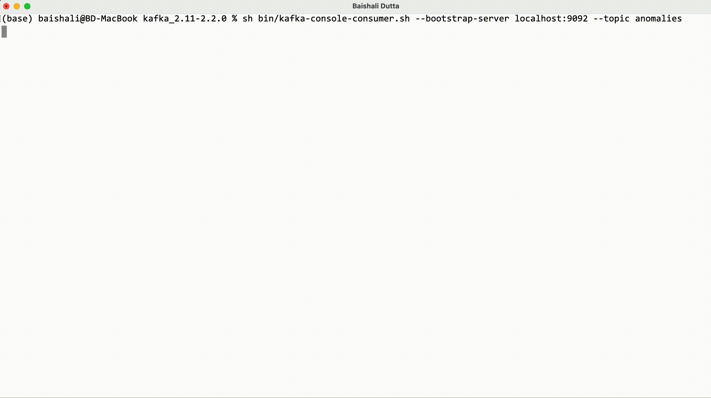

# Anomaly Detection

Project for real time anomaly detection using kafka and Python.

It's assumed that zookeeper and kafka are running in the localhost, it follows this process:

- Train an unsupervised machine learning model for anomalies detection
- Save the model to be used in real time predictions
- Generate fake streaming data and send it to a kafka topic
- Read the topic data with several subscribers to be analyzed by the model
- Predict if the data is an anomaly, if so, send the data to another kafka topic
- Subscribe a slack bot to the last topic to send a message in slack channel if
an anomaly arrives

# Demo

Generate dummy transactions into a kafka topic:


Predict and send anomalies to another kafka topic


Producer and anomaly detection running at the same time


Send notifications to Slack


# Usage:

* First train the anomaly detection model, run the file:

```bash
model/train.py
```

* Create the required topics

```bash
kafka-topics.sh --zookeeper localhost:2181 --topic transactions --create --partitions 3 --replication-factor 1
kafka-topics.sh --zookeeper localhost:2181 --topic anomalies --create --partitions 3 --replication-factor 1
```

* Check the topics are created

```bash
kafka-topics.sh --zookeeper localhost:2181 --list
```

* Check file **settings.py** and edit the variables if needed

* Start the producer, run the file

```bash
streaming/producer.py
```

* Start the anomalies detector, run the file

```bash
streaming/anomalies_detector.py
```

* Start sending alerts to Slack, make sure to register the env variable `SLACK_BOT_TOKEN`,
then run

```bash
streaming/bot_alerts.py
```

## Developer

Baishali Dutta (<a href='mailto:me@itsbaishali.com'>me@itsbaishali.com</a>)

## Contribution [](https://github.com/baishalidutta/Anomaly-Detection/issues)

If you would like to contribute and improve the model further, check out the [Contribution Guide](https://github.com/baishalidutta/Anomaly-Detection/blob/main/CONTRIBUTING.md)

## License [](https://www.apache.org/licenses/LICENSE-2.0)

This project is licensed under Apache License Version 2.0